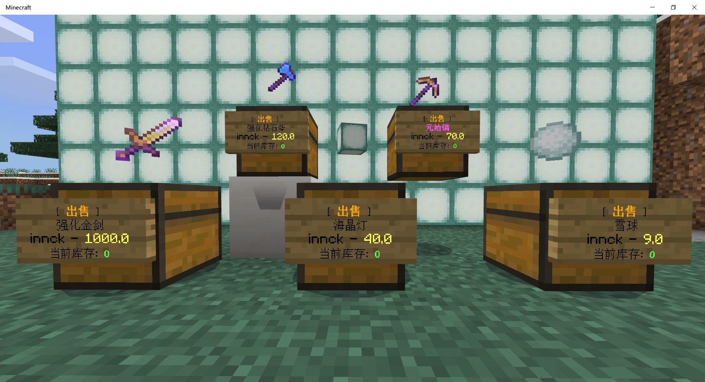
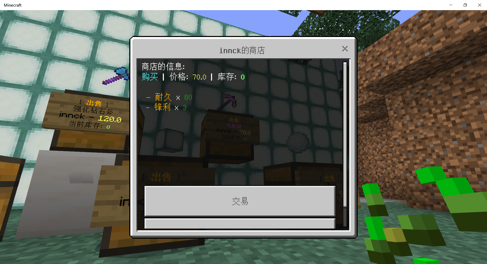
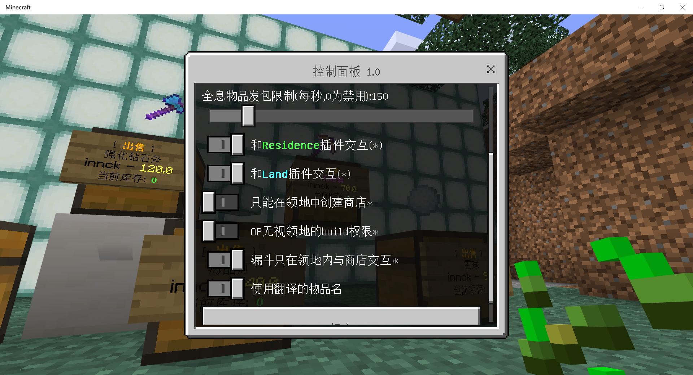
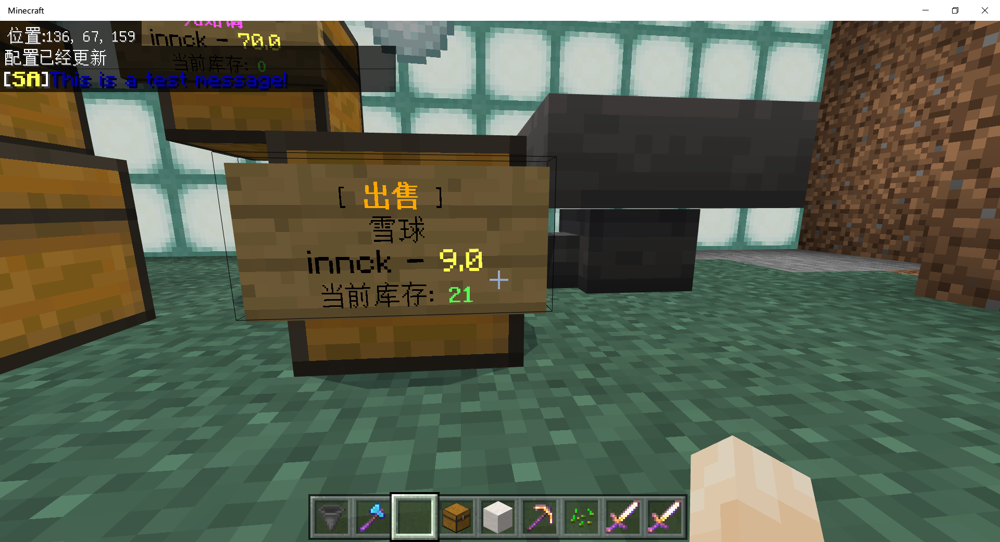

# [PepperShop](https://github.com/innc11/PepperShop)

[English](README_EN.md)

一个Nukkit插件,基于 [QuickShopX](https://github.com/innc11/QuickShopX) 开发,QuickShopX又是基于是由原作者 [WetABQ](https://github.com/WetABQ) 的QuickShop插件所开发而来

## PepperShop的特性

1. 增加对GAC插件的处理
2. 全面整合化的语言文件，99%可见文字都可以自定义修改，(除了加载语言文件时提示的那一句)
3. 同时支持Land领地插件和Residence领地插件
4. 去掉了潜行模式下破坏商店的选项
5. 合并了全息物品显示开关到滑动条上，设置完毕即时生效
6. 修复英文语言文件中的一些单词和语法问题
7. 没有安装任何领地类插件时op默认可以打开所有人箱子

## 图片 Preview










## 使用教程

### 创建

**Android**:  轻轻地饶一下箱子，但不要打掉箱子，然后切换到需要上架的物品到手上，最后直接在聊天栏输入价格即可

**Windows10**:  左键点击箱子,然后切换到要上架的物品到手上，最后直接在聊天栏输入价格即可

**创造模式**:  按住Shift然后打掉箱子后，按上面的流程创建商店，直接在聊天栏输入价格

### 交易

**聊天栏**:  在点击商店的牌子之后输入要购买的数量

**界面**:  点击商店的牌子之后打开界面，拖动交易数量点击确定

**聊天栏和界面**:  同时兼顾两者，单击牌子使用聊天栏输入，双击牌子可以打开界面操作

### 修改价格

**聊天栏:**   点击牌子后使用指令进行修改商店即可(/ps help查看具体指令)
**界面**:   点击商店的牌子后打开界面，按界面提示进行修改
**聊天栏和界面**:   同时使用聊天栏的方式和界面的方式，任选其一

### 破坏商店

打掉商店的牌子或者商店的箱子
特别说明: 在领地内拥有`build`权限(也就是同时拥有放置和破坏权限)的人也可以打开商店箱子和破坏商店

## 配置文件

```yaml
# 语言，支持加载自定义的语言文件，目前自带简体中文和英文（cn/en）
language: cn

# 强制与GAC插件一起工作，但会关闭本插件的权限检查功能
work-with-gac: false

# 商店的交互方式，可用值：ChatBar、Both、Interface，分别代表仅聊天栏、全部启用、仅UI
# 请参考 食用方法->交易 章节，推荐设置为Both
interaction-method: Both

# 商店的交互时间，如果输入价格时发现被当成普通聊天信息被发出去了，请加大此值
interaction-timeout: 5000

# 全息物品数据包的发送速率(每秒)，建议直接设置为1000，如果出现显示不正确的情况适当调低此值
hologram-item-effect: 1000

# 全息物品数据包队列的大小，如果大服出现人多时全息物品不能正常显示、移除、跨世界时，请调高此值（每次增加1万）
packet-queue-capacity: 10000

# 与Residence插件一起工作（需要先安装Residence）
link-with-residence-plugin: true

# 与Land插件一起工作（需要先安装Land）
link-with-land-plugin: true

# 是否只能在领地内创建商店（推荐打开）
# 此选项依赖任意一款领地插件，如果没有安装，则没有实际效果
only-create-shop-in-residence-area: true

# OP是否可以无视领地权限打开、破坏商店# 此选项依赖任意一款领地插件，如果没有安装，则没有实际效果
operator-ignore-build-permission: false

# 漏斗是否只能在领地内才能给商店补货，此选项不会影响非商店箱子的正常传输（仅对商店有效）# 此选项依赖任意一款领地插件，如果没有安装，则没有实际效果
# 建议打开
limit-hopper: true

# 是否使用物品翻译文件（如果你想看到中文，请参考下方的 "关于显示中文物品名"并开启此选项）
use-item-name-translations: false
```

### 插件指令

主指令：`/ps [子命令]`、别名：`/qs`

| 指令          | 用途                                 | 权限   |
| ------------- | ------------------------------------ | ------ |
| `/ps help`    | 输出帮助信息                         | 所有人 |
| `/ps buy`     | 设置商店为出售类型                   | 所有人 |
| `/ps sell`    | 设置商店为回收类型                   | 所有人 |
| `/ps price`   | 设置商店的单价                       | 所有人 |
| `/ps server`  | 设置为服务器商店(无限库存)           | 管理员 |
| `/ps version` | 输出插件版本信息                     | 管理员 |
| `/ps cp`      | 打开插件的配置面板(UI)               | 管理员 |
| `/ps reload`  | 重新加载所有配置文件（数据文件除外） | 管理员 |

每个子命令都可以进行简写，比如`/ps help`可以简写成`/ps h`，`/ps buy`可以简写成`/ps b`等，可以使用`/ps help`输出所有简写命令

## GAC兼容

需要在`config.yml`里设置`work-with-gac: true`，作为兼容的代价，权限检查功能会关闭，如果不进行此项设置，本插件不会启动

## 领地插件兼容

`PepperShop`同时支持`Residence`领地插件和`Land`领地插件，两者任选其一即可，不要同时加载，会出现一些想不到的问题

Land插件没有原生的`build`权限，如果同时拥有破坏方块权限和放置方块权限时就相当于拥有了`build`权限，两者缺一不可

### 从QuickShopx导入数据

本插件支持quickshopx的商店数据文件，将shops文件夹复制到PepperShop目录里即可，但是不支持配置文件和语言文件，这部分需要手动配置一下

### 显示中文物品名

1. 手动下载 `item-translations.yml `文件后放入插件文件夹
2. 使用指令`/ps r`，op后台均可
3. 在游戏内使用指令`/ps cp`打开配置面板
4. 打开`使用翻译的物品名`开关，点击提交按钮

如果面板没有显示对应的开关请检查文件是否放到了正确的位置

## 更新记录 Change logs

#### 1.0 (from QuickShopX)

1. 命令从/qs 变更成/ps，但保留了别名/qs
1. 配置文件结构被重构
2. 增加对GAC插件的处理
3. 全整合化的语言文件，98%可见文字都可以自定义修改
5. 同时支持Land插件和Residence插件
6. 控制面板会自动隐藏当前不可用的选项(当没有安装任何领地类插件时)
7. 修复部分quickshopx遗留下来的有问题的重载逻辑
19. 去掉了潜行模式下破坏商店的选项
11. 合并全息物品按钮，0为禁用，其它值为弃用，设置完毕即时生效
12. 没有安装任何领地类插件时op默认可以打开所有人箱子
13. custom-item-names.yml 更名为 item-translations.yml
16. 修复命令补全时看起来很奇怪的文本
17. 所有超时消息拦截被禁用，转为作为普通聊天消息处理
18. 修复英文语言文件中的一些单词和语法问题

#### 1.1

1. 修复无法从中文世界名读取配置文件的问题

#### 1.2

1. 增加对Land插件1.3.8版本以上的支持

#### 1.3

1. 修复Land插件无法被识别的问题

#### 1.3.2

1. 增加PowerNukkit-1.4.0.0-PN-ALPHA.2(1.16)版本的支持
2. 修复商店会被活塞推动的bug
3. 修复某些情况下会出现语言变量显示不正确的问题
4. 修复无法自动创建商店牌子的问题
5. 1.14以下版本再使用前请在配置文件设置using-new-api: false
6. 增加设置发包队列大小packet-queue-capacity： 10000，默认是10k，大服可适当增加此值
7. 重命名配置文件字段 interactionWay -> interactionMethod

## 作者 Authors

- [innc11](https://github.com/innc11)

## 原作者 Original Authors
- [WetABQ](https://github.com/WetABQ) 
